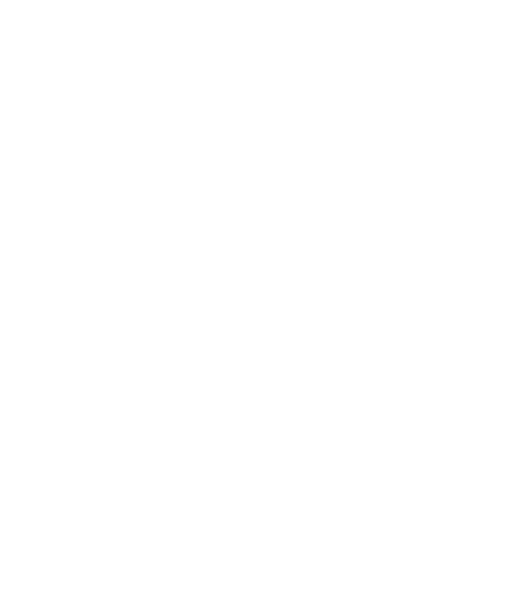

<!-- PROJECT LOGO -->
<p align="center">
  <a href="https://github.com/AykutSarac/jsoncrack.com">
   
  </a>

  <h1 align="center">My Json viewer</h1>

</p>

<!-- ABOUT THE PROJECT -->

## Getting Started

To get a local copy up and running, please follow these simple steps.

### Prerequisites

Here is what you need to be able to run JSON Crack.

- Node.js (Version: >=18.x)
- Pnpm _(recommended)_


## Development

### Setup

1. Clone the repo into a public GitHub repository. If you plan to distribute the code, read the [`LICENSE`](/LICENSE) for additional details.

   ```sh
   git clone https://github.com/AykutSarac/jsoncrack.com.git
   ```

2. Go to the project folder

   ```sh
   cd jsoncrack.com
   ```

3. Install packages with yarn

   ```sh
   pnpm install
   ```

4. Run the project

   ```sh
   pnpm dev

   # Running on http://localhost:3000/
   ```

### Docker

🐳 A [`Dockerfile`](Dockerfile) is provided in the root of the repository.
If you want to run JSON Crack locally:

```console
# Build a Docker image with:
docker compose build

# Run locally with `docker-compose`
docker compose up

# Go to http://localhost:8888
```

<!-- LICENSE -->

## License

See [`LICENSE`](/LICENSE) for more information.
